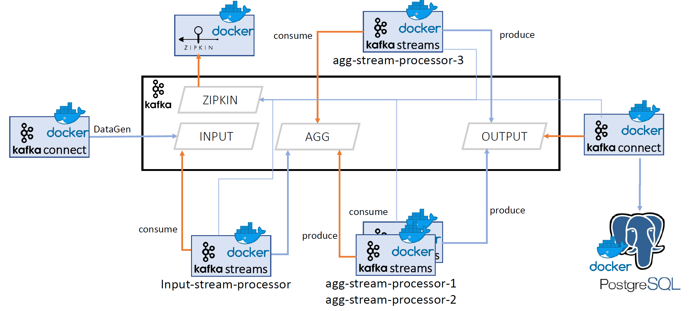

## Kafka Meetup 04-2019
##### Catch me if you can, Introduction to distributed tracing with kafka and zipkin
Slides: https://github.com/ThinkportRepo/kafka_zipkin_demo/slides


### Pre-requisites
- jdk-11+
- docker tools (docker-engine, docker-compose)

### NOTE
this demo was developed with docker for windows client, therefore the docker-compose image path had to be adjusted.
To run this on a unix based machine, just switch the image path to the relative path ./lib/kafka-interceptor-zipkin.jar

### Demo architecture



### Build and start the infrastructure

```bash
make
make start
```

#### Will start all the infrastructure components like
- kafka
- kafka-connect
- control-center
- schema-registry
- zipkin
- ksql-server
- postgres

#### create the needed topics
```bash
make create-topics
```


#### create the kafka connect input and output
```bash
make input-output
```

#### start the kafka streams application
```bash
make up-product
```
 
### The UIs

Open Zipkin:
http://localhost:9411

Open Control-Center
http://localhost:9021


